# UX Pipeline — TG Budget Planner (веб, тема Liquid Glass / native shell)

Полный UX-пайплайн текущего веб-дизайна для передачи дизайнеру. Все скриншоты
сняты с **живого** инстанса (Vite `localhost:5173` → backend `:8000`, DEV-режим
авто-логина владельца, наполненная БД: 10 категорий, 19 факт-трат, 11 plan-строк,
4 подписки, доход 180 000 ₽, активный период). Тема — `liquid_glass` (нативная
iOS-эстетика: крупные заголовки, inset-grouped карточки, bottom-sheets,
action-sheets, нижний таб-бар).

Viewport скриншотов: **390 × 844** (mobile / Telegram Mini App), 2× DPR.
Скриншоты лежат в [`screens/`](screens/), именование `NN-screen-state.png`.

---

## 0. Глоссарий состояний (нотация)

| Нотация                     | Значение                                                             |
| --------------------------- | -------------------------------------------------------------------- |
| **tab-root**                | экран — корень таба (большой заголовок, без back-кнопки)             |
| **push**                    | экран, втолкнутый поверх (есть `‹ Назад`, native push-анимация)      |
| **sheet**                   | модальный bottom-sheet (drag-handle, затемнённый фон, drag-to-close) |
| **action-sheet**            | iOS-стиль список действий снизу + «Отмена»                           |
| **picker**                  | sheet выбора одного значения (категория, дата)                       |
| **inline-editor**           | редактор внутри уже открытого sheet (без нового слоя)                |
| **segment**                 | сегмент-контрол (Расходы/Доходы, ДЕНЬ/НЕД./КАТ.)                     |
| **empty / loading / error** | пустое / загрузка / ошибка                                           |

**Знак дельты — «+ = хорошо».** Расходы: `Лимит − Факт`. Доходы: `Факт − План`.
Отрицательная дельта («В запасе») красная, положительная — зелёная/нейтральная.

---

## 1. Карта навигации

```
┌─ AUTH / GATE (поверх всего, до выбора темы) ──────────────────────────┐
│   loading «ЗАГРУЗКА…» [43]      error «ОШИБКА / ПОВТОРИТЬ» [42]         │
└───────────────────────────────────────────────────────────────────────┘
        │ /me.onboarded_at == null → ОНБОРДИНГ (одноэкранный) [34–40]
        │ /me.onboarded_at != null → ГЛАВНЫЙ SHELL ↓
        ▼
NATIVE SHELL (нижний таб-бар, 4 таба + центральный путь через «+» на Главной)
 ├─ [Таб] Главная (home)            ← tab-root, корень роутера
 │    ├─ «+» (хедер) ─────────────► sheet AddSheet «Новая транзакция» (факт)
 │    ├─ карточка «План месяца» ──► push План месяца
 │    └─ строка категории ────────► push Категория-деталь
 ├─ [Таб] Транзакции (txn)          ← push поверх роутера
 │    └─ кнопка фильтра ──────────► action-sheet «Фильтр транзакций»
 ├─ [Таб] AI (ai)                   ← push, чат-композер
 └─ [Таб] Управление (mgmt)         ← push, хаб-список
      ├─ Шаблон бюджета ───────────► push Шаблон (+ disclosure «Строки»)
      ├─ Аналитика ────────────────► push Аналитика (бар-чарт)
      ├─ Подписки ─────────────────► push Подписки ──► sheet «Меню подписки»
      ├─ Настройки ────────────────► push Настройки (+ «Привести остаток»)
      └─ Доступ (owner-only) ──────► push Доступ
```

**Таб-бар:** `Главная` (House) · `Транзакции` (ListBullets) · `AI` (Sparkle) ·
`Управление` (GearSix). Активный таб подсвечен акцентом. Тап по `Главная`
делает `popToRoot()` (сбрасывает стек). Остальные табы — `push` поверх. FAB как
такового нет: ввод факт-траты открывается «+» в хедере Главной (и кнопкой
«Добавить в план» — на экране Плана).

**Жесты:** sheet/action-sheet закрываются свайпом вниз (drag-handle), тапом по
затемнённому фону, либо кнопкой «Отмена». Push-экраны — `‹ Назад`.

---

## 2. Экраны

### 2.1 Главная (Home) — tab-root

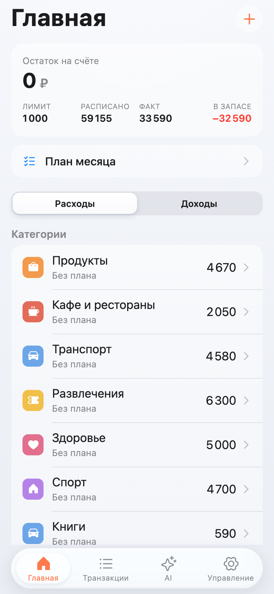
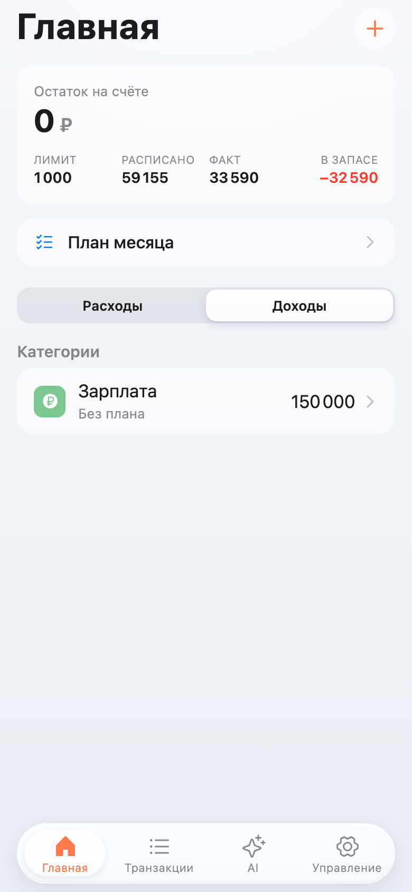

**Назначение.** Стартовый экран: остаток на счёте + актуальная дельта план/факт,
список категорий с дельтами.

**Ключевые элементы.**

- Большой заголовок «Главная», «+» справа (→ AddSheet).
- Карточка **«Остаток на счёте»** + 4-уровневый ладдер:
  `ЛИМИТ · РАСПИСАНО · ФАКТ · В ЗАПАСЕ` (Лимит = Σ лимитов категорий за период;
  Расписано = Σ непроведённых plan-строк; Факт = Σ факт-расходов;
  В запасе = Лимит − Факт, красная если отрицательна).
- Карточка-кнопка **«План месяца»** (→ push План).
- **Segment «Расходы / Доходы»** — переключает список категорий ниже.
- Список категорий (иконка + имя + «Без плана»/дельта + сумма). У каждой —
  тап → Категория-деталь.

**Состояния.** Расходы (по умолчанию) [01] / Доходы [02]. Категории «Без плана»
показывают подпись-плейсхолдер.

**Взаимодействия.**

- «+» → sheet AddSheet (факт).
- Карточка «План месяца» → push План.
- Segment → смена набора категорий (без навигации).
- Строка категории → push Категория-деталь.
- Таб «Главная» повторно → popToRoot.

---

### 2.2 AddSheet «Новая транзакция» — sheet (ввод факт-траты)

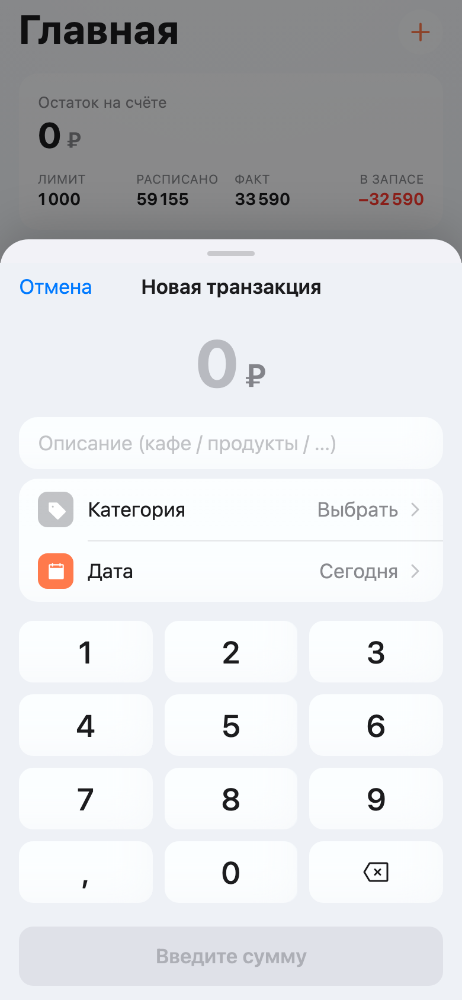
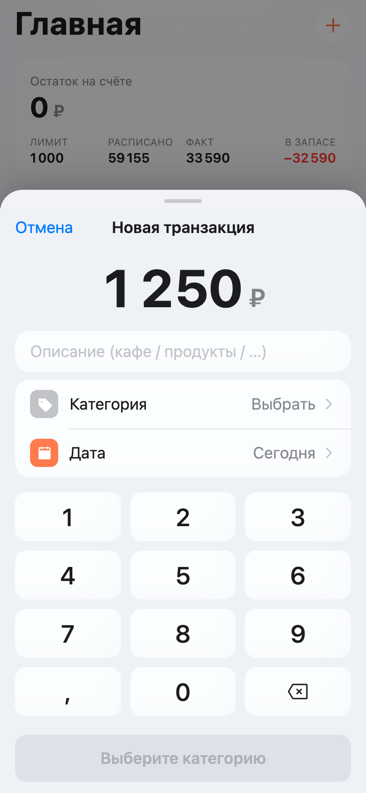
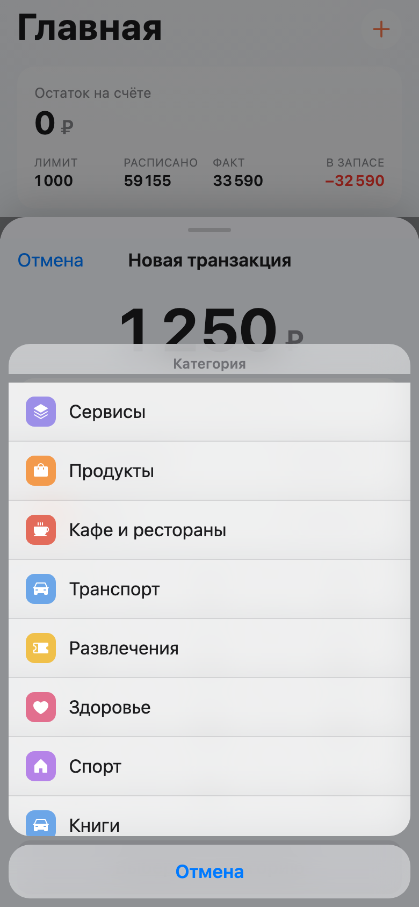
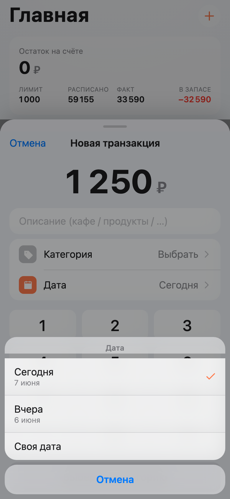
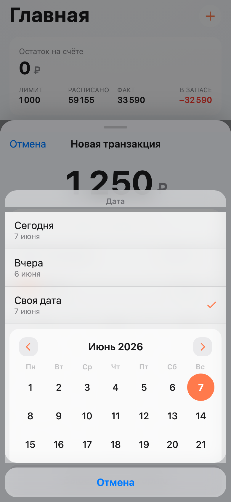
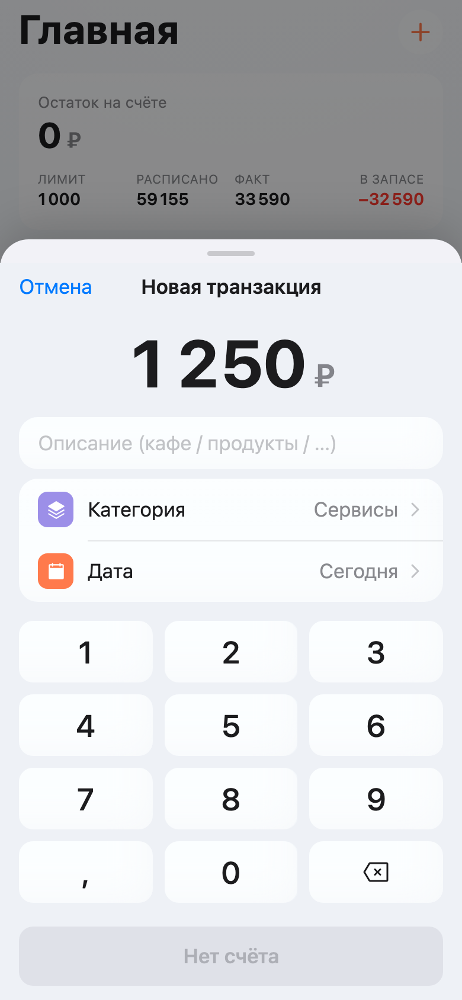
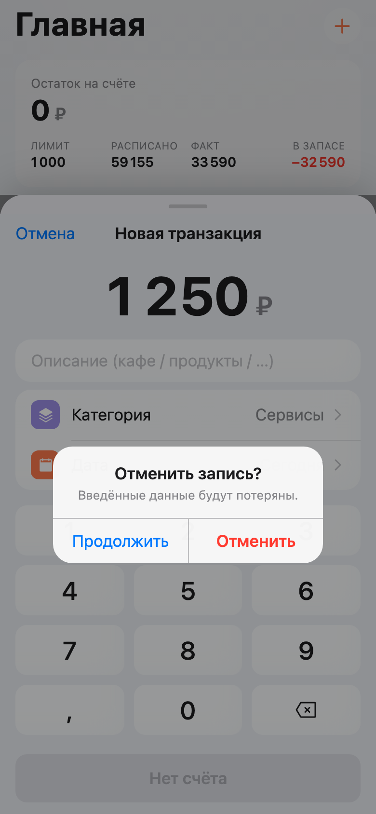

**Назначение.** Быстрый ввод факт-траты в один проход (core value продукта).

**Ключевые элементы.**

- Хедер: «Отмена» (слева) · заголовок «Новая транзакция».
- Крупный дисплей суммы `0 ₽` (растёт при наборе на keypad).
- Поле «Описание (кафе / продукты / …)».
- Строка **«Категория · Выбрать ›»** (→ picker).
- Строка **«Дата · Сегодня ›»** (→ action-sheet).
- Цифровой **keypad** (1–9, `,`, 0, backspace).
- Primary CTA снизу: `Введите сумму` (disabled) → `Добавить` (enabled, когда
  сумма > 0 и выбрана категория).

**Состояния / поток.**

1. Пустой [03] — CTA «Введите сумму» неактивна.
2. После набора суммы [04] — дисплей показывает «1 250 ₽».
3. **Picker категории** [05] — sheet со списком категорий (savings/paused скрыты),
   single-select; выбор закрывает picker и подставляет имя в строку.
4. **Дата → action-sheet** [06] — «Сегодня / Вчера / Своя дата» + «Отмена».
5. **Своя дата → календарь** [07] — раскрывается inline-месячная сетка
   (`NativeCalendar`) прямо в action-sheet.
6. Готова [08] — сумма + категория заданы, CTA «Добавить» активна.
7. **Отмена при «грязной» форме** [09] — confirm-диалог (защита от потери ввода);
   при чистой форме закрывается сразу.

**Взаимодействия.**

- keypad → меняет сумму. «Категория»/«Дата» строки → соответствующий слой.
- Submit → создаёт факт (`createActualV10`), закрывает sheet, бампит refetch-token
  (Главная/Транзакции мгновенно перечитывают данные), авто-переключение периода
  если дата вне текущего.
- Закрытие: «Отмена» / свайп / фон / Esc.

---

### 2.3 План месяца (Plan) — push

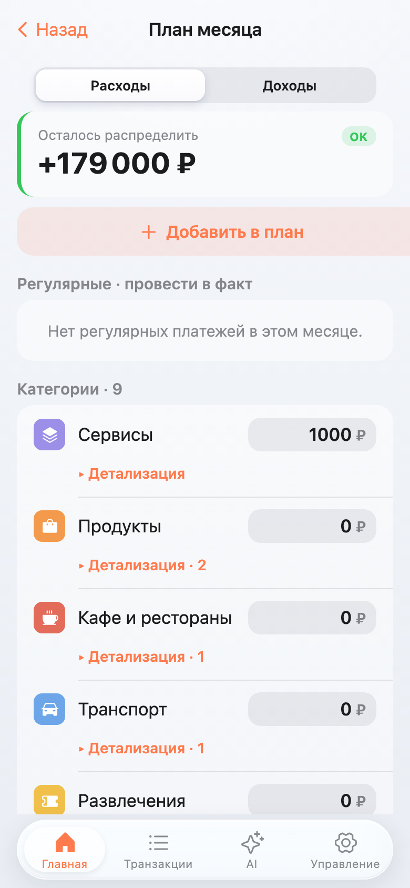
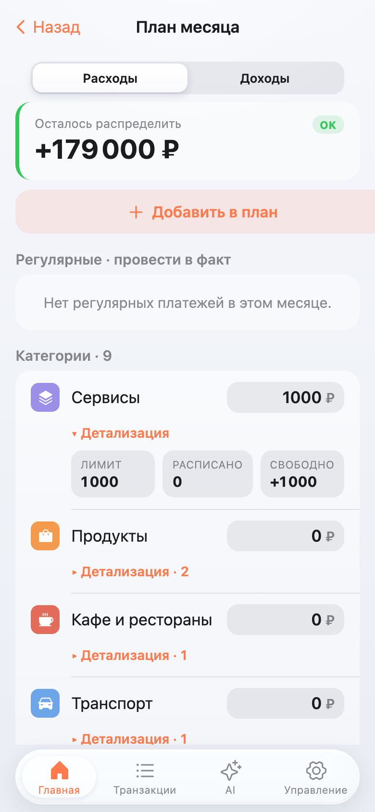
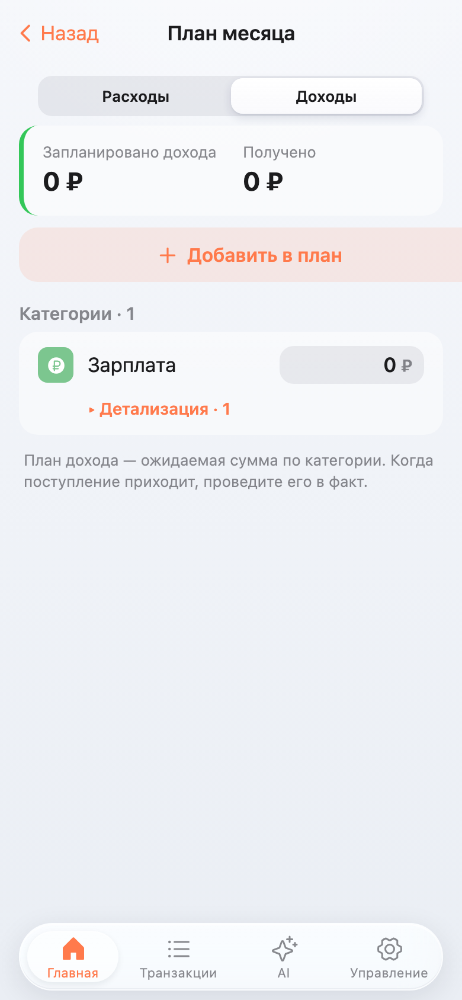

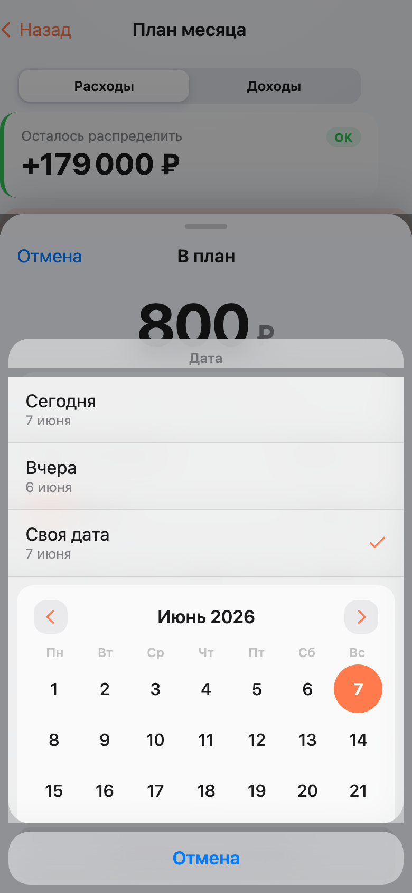

**Назначение.** Распределение бюджета месяца по категориям; перевод
запланированных строк в факт («Провести»).

**Ключевые элементы.**

- Хедер `‹ Назад` · «План месяца».
- **Segment «Расходы / Доходы»**.
- Карточка **«Осталось распределить»** (профицит): зелёный «OK» бейдж при ≥ 0,
  красный — при перерасходе.
- CTA **«+ Добавить в план»** (→ AddSheet в режиме «В план»).
- Секция **«Регулярные»** — строки подписок/повторов с кнопкой «Провести»/«Отмена».
- Список категорий: имя + поле лимита (₽, редактируемое) + disclosure
  **«Детализация · N»** (раскрывает строки плана данной категории).

**Состояния.**

- Расходы (сводка) [10] — «Осталось распределить +179 000 ₽», категории с
  лимитами и счётчиком детализации.
- **Детализация раскрыта** [11] — список plan-строк категории; per-row ладдер
  Лимит/Расписано/Свободно; у каждой строки кнопка **«Провести»** (→ факт) или
  **«Отмена»** (если уже проведена); warn-строка при перерасходе.
- Доходы [12] — segment переключён, доходные категории с план-суммой и дельтой.

**Взаимодействия.**

- Поле лимита → правка → commit (upsert лимита категории).
- «Детализация» → аккордеон (single-open).
- «Провести» на строке → создаёт факт из плановой строки; «Отмена» → откат.
- «+ Добавить в план» → AddSheet «В план» [13] (тот же keypad/категория/дата UI,
  но заголовок «В план», CTA «Добавить в план», submit = `createPlanned`).
  Календарь даты работает идентично факт-режиму [14].
- `‹ Назад` → Главная.

---

### 2.4 Категория-деталь (CategoryDetail) — push

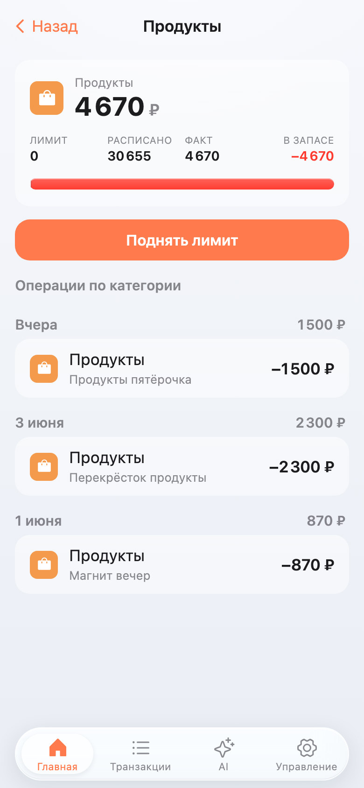

**Назначение.** Детальная картина по одной категории: ладдер лимита, прогресс,
история операций.

**Ключевые элементы.**

- Хедер `‹ Назад` · имя категории.
- Карточка-сводка: крупная сумма факта + ладдер `ЛИМИТ · РАСПИСАНО · ФАКТ ·
В ЗАПАСЕ`.
- **Прогресс-бар лимита** (ширина заливки = Факт/Лимит; tick-метка).
- CTA **«Поднять лимит»** (→ push План, сфокусированный на этой категории).
- Секция **«Операции по категории»** — day-grouped (Вчера / 3 июня / …),
  каждая операция: иконка, описание, дата, сумма со знаком.

**Состояния.** С операциями [15] / empty («Нет операций» — `native-cat-empty`,
не снят, т.к. у всех seed-категорий есть данные).

**Взаимодействия.** «Поднять лимит» → План. `‹ Назад` → Главная.

---

### 2.5 Транзакции (Transactions) — push (таб)

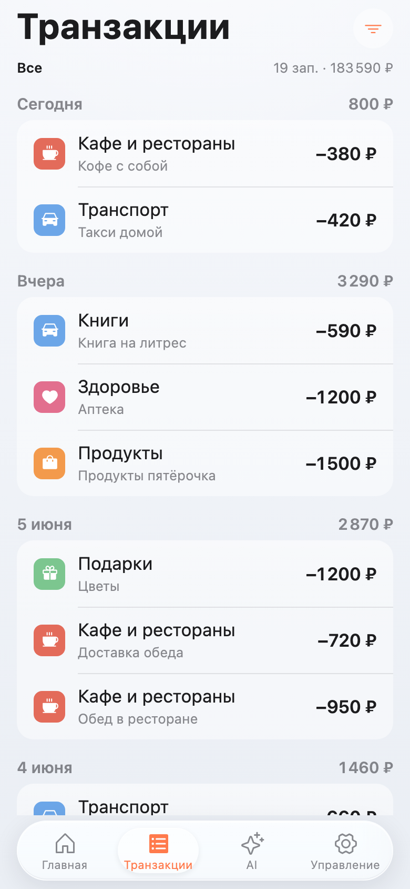
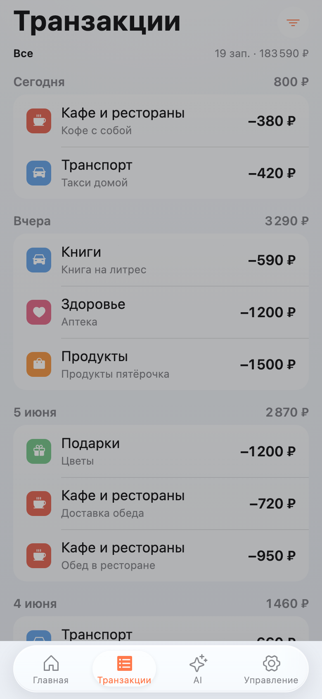


**Назначение.** Полная лента операций с фильтрацией.

**Ключевые элементы.**

- Большой заголовок «Транзакции» + круглая кнопка-фильтр (Funnel).
- Строка-сводка «{N} записей · {Σ ₽}» + текущий фильтр.
- Day-grouped список операций.

**Состояния.** Список [16] / фильтр открыт [17] / пусто [41].

**Взаимодействия.**

- Кнопка фильтра → action-sheet (6 опций single-select: Все / Расходы / Доходы /
  …). Выбор сужает ленту и обновляет сводку.
- Таб «Транзакции» (push поверх роутера).

---

### 2.6 AI — push (таб)


**Назначение.** Чат-ассистент по бюджету (естественный язык).

**Ключевые элементы.** Заголовок, начальное/initial-состояние, composer-input
снизу, индикатор «лимита» (`ai-cap-value`), typing-индикатор при ответе.

**Состояния.** initial [18] (снято); active/typing (диалог) — требует реального
запроса к LLM, не снято.

**Взаимодействия.** Ввод в composer → отправка → ответ ассистента. Таб «AI».

---

### 2.7 Управление (Management hub) — push (таб)

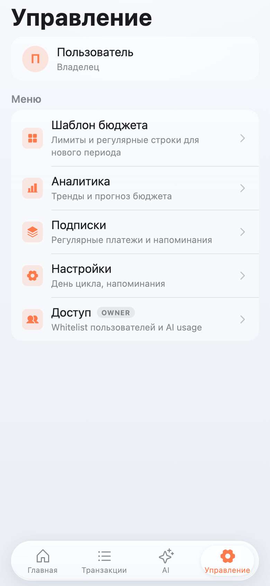

**Назначение.** Хаб-меню второстепенных разделов.

**Ключевые элементы.** Список-строки с chevron: **Шаблон бюджета · Аналитика ·
Подписки · Настройки · Доступ** (последняя — owner-only, с бейджем OWNER).

**Взаимодействия.** Тап по строке → push соответствующего экрана. Таб «Управление».

---

### 2.8 Шаблон бюджета (Template) — push

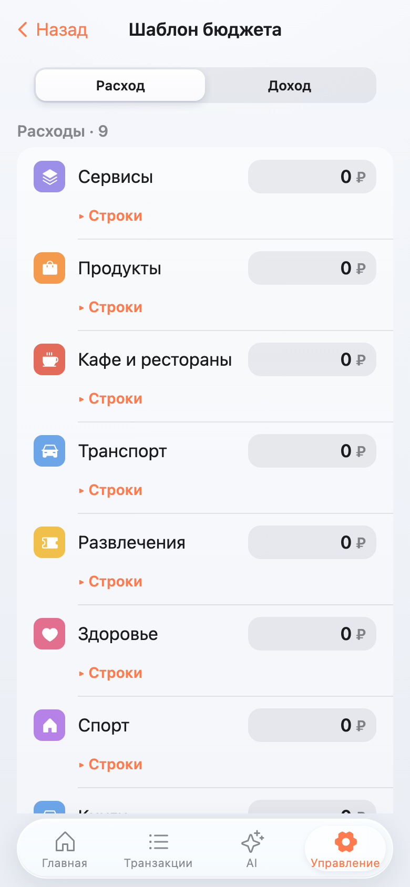
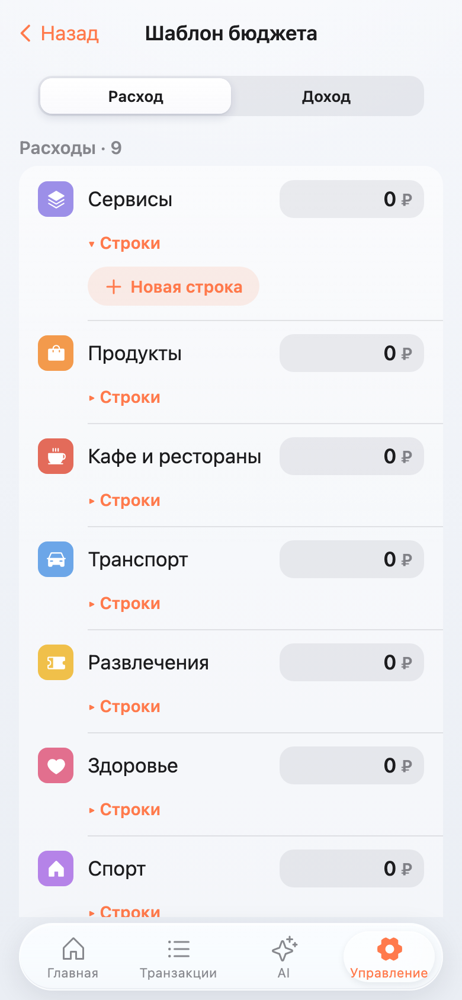

**Назначение.** Повторяемый шаблон плана: лимиты категорий + регулярные строки,
из которого формируется план каждого месяца.

**Ключевые элементы.**

- Хедер `‹ Назад` · «Шаблон …». Segment Расход/Доход.
- Per-category строка: имя + поле лимита (₽) + disclosure **«▸ Строки · N»**.
- Раскрытая строка [21]: список регулярных строк (title, сумма, день периода,
  kind) с CRUD + «+ добавить строку».

**Состояния.** Список [20] / строка раскрыта [21] / empty (`native-template-empty`,
не снят — шаблон наполнен).

**Взаимодействия.** Правка лимита → commit. Disclosure → аккордеон. CRUD строк.

---

### 2.9 Аналитика (Analytics) — push

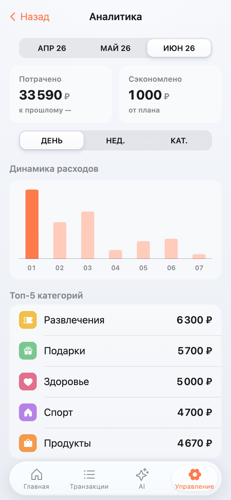
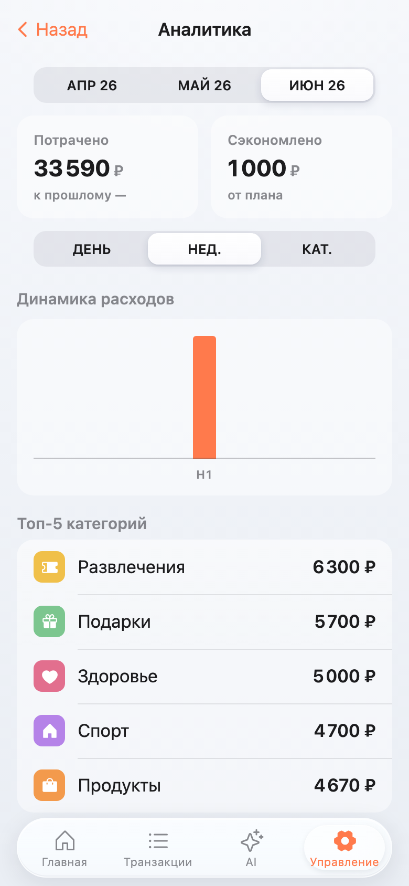
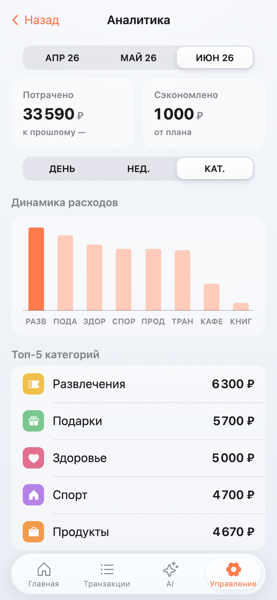

**Назначение.** Визуальная аналитика расходов по периодам и группировкам.

**Ключевые элементы.**

- Хедер `‹ Назад` · «Аналитика».
- **Segment периодов** (последние 3 месяца: АПР / МАЙ / ИЮН).
- KPI-карточки: «Потрачено» (к прошлому) · «Сэкономлено» (от плана).
- **Segment группировки ДЕНЬ / НЕД. / КАТ.**.
- Бар-чарт «Динамика расходов» (пик-бар подсвечен).
- «Топ-5 категорий» — inset-список.

**Состояния.** ДЕНЬ [22] / НЕД. [23] / КАТ. [24]; loading/error
(`native-analytics-loading/error`) не снято (данные есть).

**Взаимодействия.** Оба segment-контрола перестраивают чарт. Выбор месяца — то же.

---

### 2.10 Подписки (Subscriptions) — push + sheet


**Назначение.** Управление повторяющимися списаниями (напоминания + авто-charge).

**Ключевые элементы списка.**

- Сводка «{Σ}/мес · {N} активных · {Σ}/год».
- Строки: иконка, имя, периодичность («ежемесячно», «· на паузе»), цена, «···».

**Меню подписки (sheet)** [26].

- Заголовок = имя. Инфо-блок: **Цена** (`{₽} / мес`) · **Периодичность** · (День).
- Действия (акцентные list-rows): **«Сменить день»**, **«Изменить цену»**.
- Деструктивная кнопка **«Отменить подписку»** (красная).

**Inline-редакторы (в том же sheet).**

- «Сменить день» [27] — числовое поле дня периода + «Отмена/Сохранить».
- «Изменить цену» [28] — поле цены + «Отмена/Сохранить».
- «Отменить подписку» [29] — confirm «Отменить подписку «{name}»?» (деструктив).

**Взаимодействия.** «···» / тап по строке → sheet-меню. Действия открывают
inline-редактор (без нового слоя). Сохранение → апдейт + закрытие редактора.

---

### 2.11 Настройки (Settings) — push


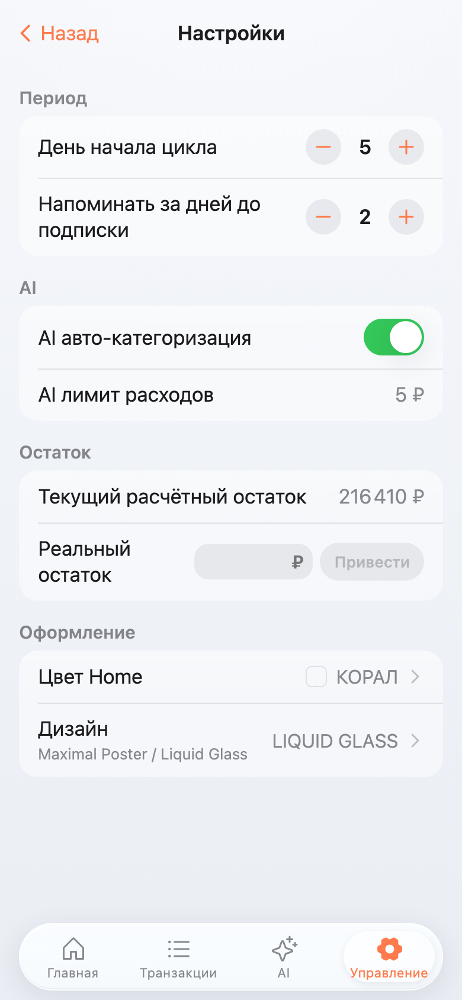
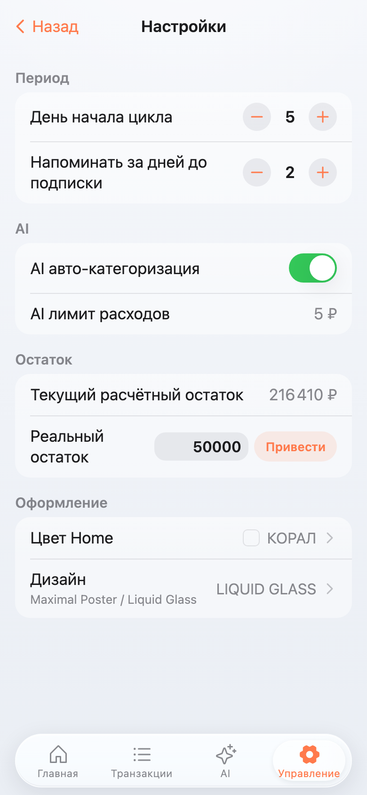

**Назначение.** Параметры бюджета + сверка реального остатка (reconcile).

**Ключевые элементы.**

- Хедер `‹ Назад` · «Настройки». Степперы/параметры (день цикла, AI-лимит и пр.).
- **«Привести остаток»**: readonly «Текущий расчётный остаток»
  (`reconcile-current`) + поле «Реальный остаток» (`reconcile-input`) + кнопка
  **«Привести»** (`reconcile-submit`).

**Состояния.** Базовый [30] / reconcile-секция [31] / введено значение [32];
loading/error (`native-settings-loading/error`) не снято.

**Взаимодействия.** Ввод реального остатка → «Привести» → создаёт корректирующую
операцию, выравнивающую расчётный остаток с фактическим.

---

### 2.12 Доступ (Access) — push (owner-only)

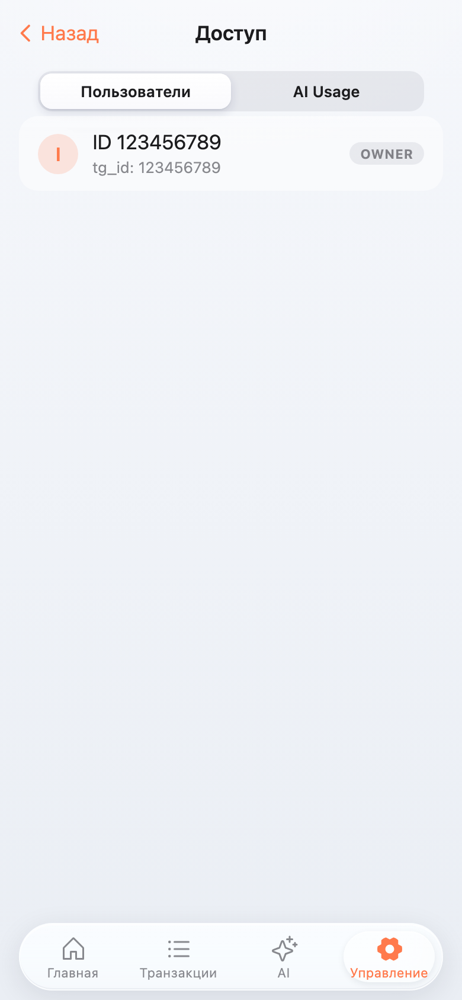

**Назначение.** Управление участниками (RLS multi-tenant, роли owner/member) +
AI-usage по пользователям.

**Ключевые элементы.** Список пользователей (`native-access-users`), AI-usage
(`native-access-ai-usage`).

**Состояния.** Базовый [33]; loading/error (`native-access-loading/error`)
не снято.

---

### 2.13 Онбординг (Onboarding) — одноэкранный, поверх gate


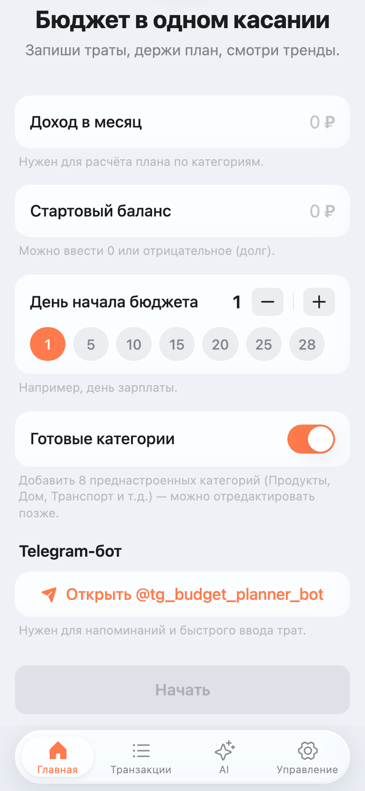

**Назначение.** Первичная настройка при `onboarded_at == null`. В нативной теме —
**один скролл-экран** (не мастер из шагов).

**Ключевые элементы (сверху вниз).**

- Иконка ₽ + заголовок «Бюджет в одном касании» + подзаголовок.
- **«Доход в месяц»** (`native-onb-income`) [35] — для расчёта плана.
- **«Стартовый баланс»** (`native-onb-balance`) [36] — можно 0 или отрицательный (долг).
- **«День начала бюджета»** (`native-onb-cycle`) [37] — stepper + чипы 1/5/10/15/20/25/28.
- **«Готовые категории»** toggle (`native-onb-presets`) [38] — 8 пресет-категорий.
- **«Telegram-бот»** ссылка (`native-onb-bot`) [39] — открыть бота.
- CTA **«Начать»** (`native-onb-start`) [40].

**Взаимодействия.** Заполнение полей → «Начать» собирает draft, постит онбординг,
рефетчит `/me` → флип на Главную. Скриншоты 35–40 — последовательные секции
одного экрана (через scrollIntoView), а не отдельные шаги.

---

### 2.14 Gate-состояния (до выбора темы)

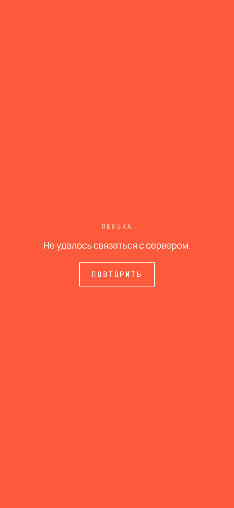


**Назначение.** Auth/data-gate, рендерится **до** ветвления темы — поэтому в
poster-эстетике (full-bleed акцент-фон), а не в liquid-glass. Дизайнеру: это
осознанный «до-загрузочный» слой.

- **Загрузка** [43] — «ЗАГРУЗКА…» по центру.
- **Ошибка** [42] — «ОШИБКА / Не удалось связаться с сервером / ПОВТОРИТЬ».

---

## 3. Пользовательские сценарии (end-to-end)

1. **Онбординг → первый запуск.** Gate (loading [43]) → Онбординг [34–40]
   (доход, баланс, день цикла, пресеты, бот) → «Начать» → Главная [01].
2. **Ввод факт-траты (core value).** Главная [01] → «+» → AddSheet [03] →
   набор суммы [04] → выбор категории [05] → (опц.) дата [06]/[07] → «Добавить»
   [08] → sheet закрыт, Главная/ладдер обновлены мгновенно.
3. **Планирование месяца.** Главная → «План месяца» [10] → правка лимитов,
   «Детализация» [11] → «+ Добавить в план» [13]/[14]; Доходы-сегмент [12].
4. **Проведение плана в факт.** План [10] → «Детализация» [11] → «Провести» на
   строке → plan-строка становится фактом (дельта пересчитана).
5. **Подписки.** Управление [19] → Подписки [25] → «···» [26] → Сменить день
   [27] / Изменить цену [28] / Отменить [29].
6. **Reconcile (сверка остатка).** Управление [19] → Настройки [30] → «Привести
   остаток» [31] → ввод реального остатка [32] → «Привести» → корректирующая
   операция.
7. **Анализ.** Управление [19] → Аналитика [22] → переключение ДЕНЬ/НЕД./КАТ.
   [23]/[24] и месяцев.
8. **Деталь категории.** Главная [01] → строка категории → Категория-деталь [15]
   → «Поднять лимит» → План.

---

## 4. Полный индекс скриншотов (43)

| #   | Файл                                 | Экран / состояние                             |
| --- | ------------------------------------ | --------------------------------------------- |
| 01  | `01-home-expenses.png`               | Главная — Расходы (tab-root)                  |
| 02  | `02-home-income.png`                 | Главная — Доходы (segment)                    |
| 03  | `03-addsheet-fact-empty.png`         | AddSheet (факт) — пустой                      |
| 04  | `04-addsheet-fact-amount.png`        | AddSheet — введена сумма                      |
| 05  | `05-addsheet-category-picker.png`    | AddSheet — picker категории                   |
| 06  | `06-addsheet-date-actionsheet.png`   | AddSheet — дата (action-sheet)                |
| 07  | `07-addsheet-date-calendar.png`      | AddSheet — дата (календарь)                   |
| 08  | `08-addsheet-fact-ready.png`         | AddSheet — готова (CTA активна)               |
| 09  | `09-addsheet-cancel-confirm.png`     | AddSheet — подтверждение отмены               |
| 10  | `10-plan-expenses-summary.png`       | План — Расходы (сводка/профицит)              |
| 11  | `11-plan-detail-expanded.png`        | План — детализация раскрыта (+«Провести»)     |
| 12  | `12-plan-income.png`                 | План — Доходы (segment)                       |
| 13  | `13-plan-addsheet.png`               | AddSheet «В план»                             |
| 14  | `14-plan-addsheet-calendar.png`      | AddSheet «В план» — календарь                 |
| 15  | `15-category-detail.png`             | Категория-деталь (ладдер/прогресс/операции)   |
| 16  | `16-transactions-list.png`           | Транзакции — список                           |
| 17  | `17-transactions-filter-sheet.png`   | Транзакции — фильтр (action-sheet)            |
| 18  | `18-ai-tab.png`                      | AI — initial                                  |
| 19  | `19-management-hub.png`              | Управление — хаб                              |
| 20  | `20-template.png`                    | Шаблон бюджета                                |
| 21  | `21-template-row-expanded.png`       | Шаблон — строка раскрыта («Строки»)           |
| 22  | `22-analytics-day.png`               | Аналитика — ДЕНЬ (бар-чарт)                   |
| 23  | `23-analytics-week.png`              | Аналитика — НЕД.                              |
| 24  | `24-analytics-category.png`          | Аналитика — КАТ.                              |
| 25  | `25-subscriptions-list.png`          | Подписки — список                             |
| 26  | `26-subscription-menu.png`           | Подписки — меню (Цена/Периодичность/действия) |
| 27  | `27-subscription-change-day.png`     | Подписки — Сменить день                       |
| 28  | `28-subscription-change-price.png`   | Подписки — Изменить цену                      |
| 29  | `29-subscription-cancel-confirm.png` | Подписки — отмена (confirm)                   |
| 30  | `30-settings.png`                    | Настройки                                     |
| 31  | `31-settings-reconcile.png`          | Настройки — «Привести остаток»                |
| 32  | `32-settings-reconcile-filled.png`   | Настройки — остаток введён                    |
| 33  | `33-access.png`                      | Доступ (owner-only)                           |
| 34  | `34-onboarding-top.png`              | Онбординг — верх                              |
| 35  | `35-onboarding-income.png`           | Онбординг — доход                             |
| 36  | `36-onboarding-balance.png`          | Онбординг — стартовый баланс                  |
| 37  | `37-onboarding-cycle.png`            | Онбординг — день начала бюджета               |
| 38  | `38-onboarding-presets.png`          | Онбординг — готовые категории                 |
| 39  | `39-onboarding-bot.png`              | Онбординг — Telegram-бот                      |
| 40  | `40-onboarding-start.png`            | Онбординг — «Начать»                          |
| 41  | `41-transactions-empty.png`          | Транзакции — пусто                            |
| 42  | `42-error-state.png`                 | Gate — ошибка                                 |
| 43  | `43-loading-state.png`               | Gate — загрузка                               |

---

## 5. Что НЕ снято и почему

- **AI active/typing** — требует реального ответа LLM на живой запрос; снят только
  initial-экран.
- **empty-состояния** Категория-деталь / Шаблон / Подписки / loading-error
  Аналитики / Настроек / Доступа — БД наполнена, эти ветки недостижимы без
  спец-моков конкретных эндпоинтов (а часть из них защищена `require_onboarded`).
- **Тосты успеха** (после submit факта/плана) — короткоживущие, не попали в кадр;
  поведение описано в §2.2 (refetch + закрытие sheet).
- **Gate-состояния [42][43]** сняты через перехват `/me` (500 / задержка) — это
  единственные «синтетические» кадры; «Транзакции — пусто» [41] — через мок
  пустого списка операций.

Все остальные кадры — реальные интеракции на живом инстансе (тапы по строкам,
открытие sheets, переключение сегментов/периодов, набор на keypad).
